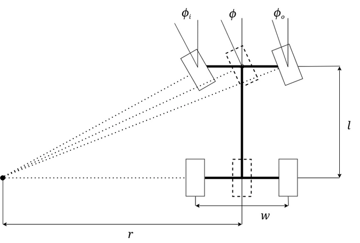

# MrPeterBot 🤖
> *Inspired by Mr. Peterson from Hello Neighbour* 🏠

Autonomous car robot that detects troublesome 
neighbours and comes after you. 🚨

## Stack
ROS2 Jazzy · Gazebo Harmonic · Nav2 · 
slam_toolbox · C++ · Python · YOLO v26

## Usage

### Launch simulation
```bash
ros2 launch mr_peterbot_bringup display.launch.py
```

### Manual control (quick test)
```bash
# Moving Forwards
ros2 topic pub /velocity std_msgs/msg/Float64 "data: 0.2" --rate 50
# Steering
ros2 topic pub /steering_angle std_msgs/msg/Float64 "data: 0.3" --rate 50
```

## Roadmap
- [x] ROS2 workspace setup
- [x] Ackermann steering robot URDF from scratch
- [x] Gazebo Harmonic simulation
- [x] ros2_control — Ackermann steering + rear wheel drive
- [x] Ackermann control node (C++)
- [x] LQR Controller (v, θ) added
- [ ] Xbox joystick controller
- [ ] 2D SLAM with slam_toolbox
- [ ] Autonomous navigation with Nav2
- [ ] Person detection with YOLO v26
- [ ] Pursuit behavior 😈
- [ ] Siren sound on detection 🔊

## LQR Controller (High Level)

A Python based ROS2 node which implements a LQR based controller that calculates the optimal velocity $v_{cmd}$ and steering angle $\phi_{cmd}$ to minimise the tracking error between the current and the desired state.

### Bicycle Model

For simplification, MrPeterBot modelling is simplified using the bicycle model, as seen in the figure below. This simplification is valid for Ackermann vehicles moving on flat ground, where lateral slip is negligible.



In this case, as the velocity and the steering angle want to be controlled, the following set of states and inputs are defined:

$$\mathbf{x} = \begin{bmatrix} v \\ \theta \end{bmatrix}, \quad \mathbf{u} = \begin{bmatrix} v_{cmd} \\ \phi_{cmd} \end{bmatrix}$$

#### Kinematic Modelling

$$\dot{x} = v\cos\theta, \quad \dot{y} = v\sin\theta, \quad \dot{\theta} = \frac{v\tan\phi}{l}$$

where $l = 0.26$ m is the wheelbase and $\theta$ is the yaw angle (rotation around Z).

#### Linearisation

As can be seen in the equations above, the kinematic model is non-linear. To apply the LQR controller, the equations must be linearised using the Taylor series expansion method, obtaining:

$$\delta\dot{\mathbf{x}} = \mathbf{A}\,\delta\mathbf{x} + \mathbf{B}\,\delta\mathbf{u}$$

$$\mathbf{A} = \begin{bmatrix} -1/\tau_v & 0 \\ \tan\phi_0/l & 0 \end{bmatrix}, \quad
\mathbf{B} = \begin{bmatrix} 1/\tau_v & 0 \\ 0 & v_0\sec^2\phi_0/l \end{bmatrix}$$

where $\tau_v = 0.1$ s is the velocity time constant and $\delta\mathbf{x} = \mathbf{x}_{ref} - \mathbf{x}_0$ is the tracking error.

It is important to note that since the equations are linearised around an operating point, the matrices **A** and **B** must be recalculated at each iteration around the current operating point $(v_0, \phi_0)$.

#### Optimal Gain

The LQR minimises the quadratic cost:

$$J = \int_0^\infty \left(\delta\mathbf{x}^\top \mathbf{Q}\,\delta\mathbf{x} + \delta\mathbf{u}^\top \mathbf{R}\,\delta\mathbf{u}\right) dt$$

The optimal gain $\mathbf{K}$ is calculated at every iteration by solving the Algebraic Riccati Equation (ARE):

$$\mathbf{A}^\top\mathbf{P} + \mathbf{P}\mathbf{A} - \mathbf{P}\mathbf{B}\mathbf{R}^{-1}\mathbf{B}^\top\mathbf{P} + \mathbf{Q} = \mathbf{0}, \quad \mathbf{K} = \mathbf{R}^{-1}\mathbf{B}^\top\mathbf{P}$$

#### Control Law

Finally, the LQR control law is:

$$\boxed{\mathbf{u} = \mathbf{K}\,(\mathbf{x}_{ref} - \mathbf{x}_0)}$$

#### Tuning

| Parameter | Value | Meaning |
|-----------|-------|---------|
| $q_v$ | 10.0 | Penalty on velocity error |
| $q_\theta$ | 20.0 | Penalty on heading error |
| $r_v$ | 1.0 | Penalty on velocity command effort |
| $r_\phi$ | 1.0 | Penalty on steering command effort |

### Running the LQR

Manual control:
```bash
ros2 topic pub /v_ref std_msgs/msg/Float64 "data: 0.2" --rate 50
ros2 topic pub /theta_ref std_msgs/msg/Float64 "data: 0.0" --rate 50
```

Circle test:
```bash
ros2 run mr_peterbot_control circle_test.py
```

## Acknowledgements
Ackermann steering architecture inspired by [Lucas Mazzetto's Ackermann Steering Vehicle Simulation](https://workabotic.com/2025/ackermann-steering-vehicle-simulation/) — great reference for ROS 2 + Gazebo Harmonic integration of 4 wheels mobile vehicles.

## Warning
Do not deploy in close neighbourhoods.
MrPeterBot shows no mercy. 🏃

### References
- Rajamani, R. *Vehicle Dynamics and Control*, Springer 2012 — bicycle model
- Ogata, K. *Modern Control Engineering*, Prentice Hall 2010 — LQR theory